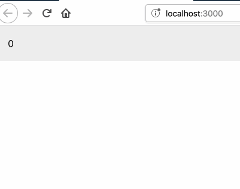

# Demo for React Window Bubbling

<p align="center"><kbd></kbd></p>

Instead of using `postMessage` to communicate between parent & child windows, we can use [React Portals](https://reactjs.org/docs/portals.html) & the [window.open()](https://developer.mozilla.org/en-US/docs/Web/API/Window/open) API.

Inspired by [this tweet](https://twitter.com/ryanflorence/status/1064612600317534208) by @ryanflorence, and [this code sample](https://twitter.com/shovnr/status/1064623209545224192) by @shovnr.

## The Code

Everything is in [src/index.js](src/index.js).

```javascript
import React, { useState } from "react";
import ReactDOM from "react-dom";
import "./index.css";
import * as serviceWorker from "./serviceWorker";

const newWindow = window.open(
  "",
  "",
  "left=100,top=100,width=200,height=200,centerscreen=yes"
);
const externalBody = newWindow.document.querySelector("body");

const App = () => {
  const [count, setCount] = useState(0);

  return (
    <div className="App">
      {count}

      {ReactDOM.createPortal(
        <button
          onClick={() => {
            setCount(count + 1);
          }}
        >
          +1
        </button>,
        externalBody
      )}
    </div>
  );
};

ReactDOM.render(<App />, document.getElementById("root"));
```